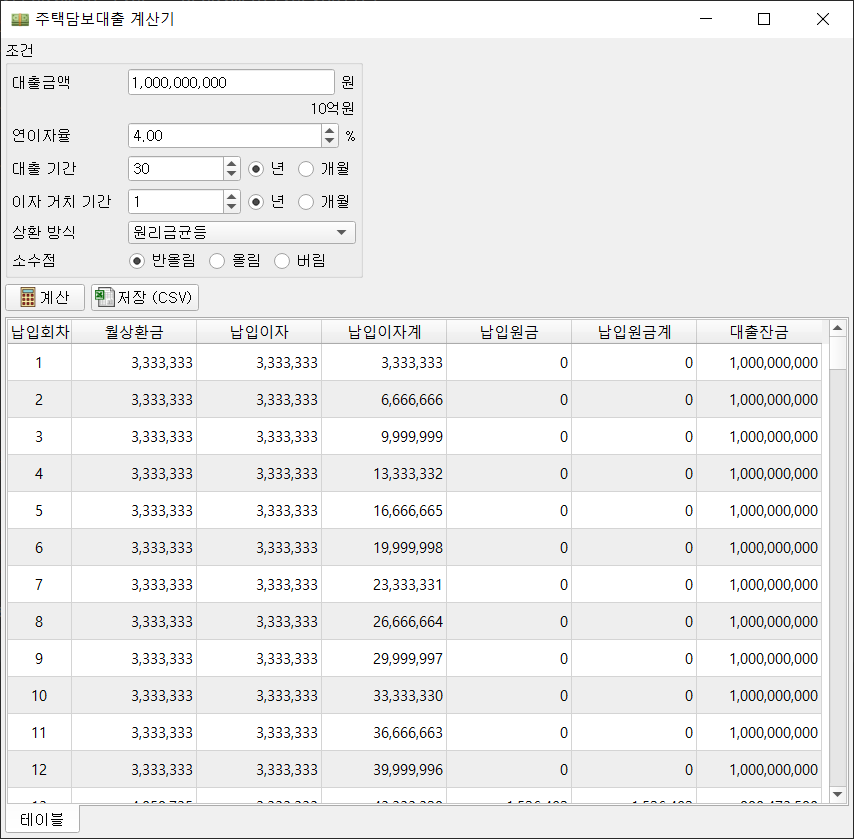

# Mortgage Loan Calculator

파이썬으로 구현한 대출 이자 및 원금 상환액 계산기 <br>

상환방식
- 원리금균등상환: 매달 납입하는 원금이 동일, 이자가 매달 감소
- 원금균등상환: 매달 납입하는 상환액 (원금 + 이자)이 동일, 이자비율이 감소됨
- 만기일시상환: 매달 이자만 납입, 만기일에 원금 일시 상환

이자 거치 기간: 원금 납부없이 이자만 납부하는 기간 



- 매달 상환액 (이자 + 원금), 납부한 이자/원금 총액, 잔금 정보를 테이블 형식으로 출력
- 계산 결과를 CSV 파일로 저장 가능
- 계산 시 조건이 로컬 디스크에 설정 파일(XML)로 저장되며, 다음 실행 시 자동으로 로드됨

참고
---
- 금리변동에 대한 계산은 구현하지 않음
- 계산된 액수는 은행에서 실제로 징수하는 금액과 상이할 수 있음 (참고용으로만 사용 권장)

Software
---
Python 3.8 환경에서 구현 및 테스트 <br>
필수 라이브러리
```
numpy
pandas
PyQt5
```

실행 방법
---
```commandline
python main.py
```

TODO
---
- 단독 실행 파일 (.exe) 생성
- 금리 변동 적용
- 시각화
- 웹서버 구현

관련페이지
---
[Python - 대출 이자 계산기 앱 개발](https://yogyui.tistory.com/entry/Python-%EB%8C%80%EC%B6%9C-%EC%9D%B4%EC%9E%90-%EA%B3%84%EC%82%B0%EA%B8%B0-%EC%95%B1-%EA%B0%9C%EB%B0%9C) <br>
